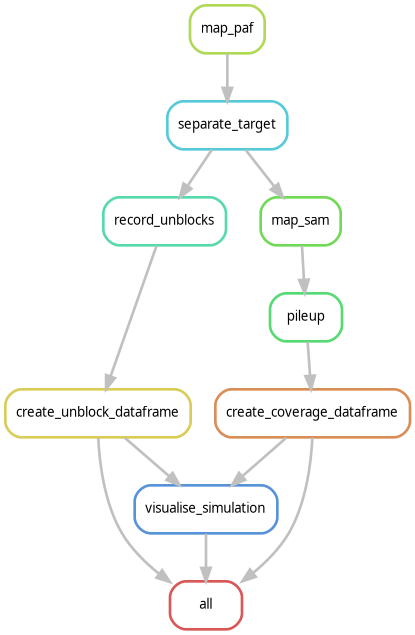
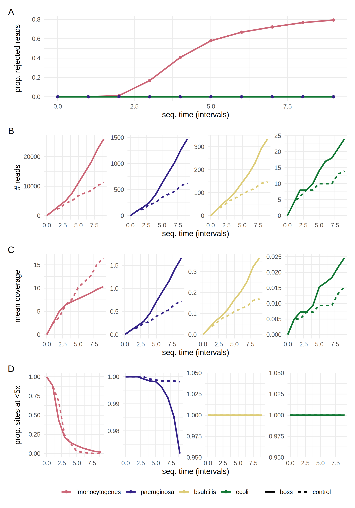

# Example of a simulation and its analysis

## Get the data


Download and extract the reference genomes from zymo. 

```
wget https://s3.amazonaws.com/zymo-files/BioPool/ZymoBIOMICS.STD.refseq.v2.zip -O data/zymo.zip
unzip data/zymo.zip -d data/zymo
```

Merge a subset of the genomes into a single file that we use as reference for the simulation.

```
cat data/zymo/ZymoBIOMICS.STD.refseq.v2/Genomes/Listeria_monocytogenes_complete_genome.fasta\
 data/zymo/ZymoBIOMICS.STD.refseq.v2/Genomes/Pseudomonas_aeruginosa_complete_genome.fasta\
 data/zymo/ZymoBIOMICS.STD.refseq.v2/Genomes/Bacillus_subtilis_complete_genome.fasta\
 data/zymo/ZymoBIOMICS.STD.refseq.v2/Genomes/Escherichia_coli_complete_genome.fasta >data/zymo.fa
```

Download, extract and subset some sequencing reads from zymo log

```
wget 'ftp://ftp.sra.ebi.ac.uk/vol1/fastq/ERR315/006/ERR3152366/ERR3152366.fastq.gz' -O data/ERR3152366.fastq.gz
unzip --keep data/ERR3152366.fastq.gz
head -n 400000 data/ERR3152366.fastq >data/ERR3152366_100k.fq
```


Run the snakemake pipeline that prepares reads for simulations, i.e. that maps the reads and creates the offset files for fast sampling. 
This pipeline is part of the BOSS-RUNS repository (adjust path to snakefile).

```
cd data && snakemake -s ../../BOSS-RUNS/scripts/prepare_simulation_data.smk --config ref=zymo.fa reads=ERR3152366_100k.fq -c1
```


## Run the simulation

Run a short simulation that uses the data downloaded above. Should take only a few minutes.


```
boss --toml zymo_simulation.toml
```


## Run the snakemake analysis pipeline

The simulation produces files with sequencing reads in 00_reads. In this case, it should be ~20 files for control and about half as many for bossruns.

The way that the output of the simulations work is that we keep track of the pseudo-time it takes to sequence each batch of reads depending on the decisions that are taken.
So for 2 conditions, they both see the same reads, but if bossruns rejects some of them, the time that it takes to sequence that same batch of reads will be different between the two conditions.
So a cache (the ReadCache class) collects the processed reads, which can be either full-length or truncated to mu, and as soon as the total sequencing time has reached a multiple of the dump time for one of the conditions,
a new file will appear in 00_reads. Additionally, new files in that directory will be cumulative, i.e. contain all reads that were encountered by that condition up to that point in the sequencing process.
So the files in 00_reads are written 'asynchronously' for the two conditions, but files with the same output number will reflect the same time spent sequencing.


```
snakemake -c 4 --workflow-profile workflow/profile/default
```

This is the rulegraph of the workflow:




This visualisation of the simulation is the final result of the workflow:



